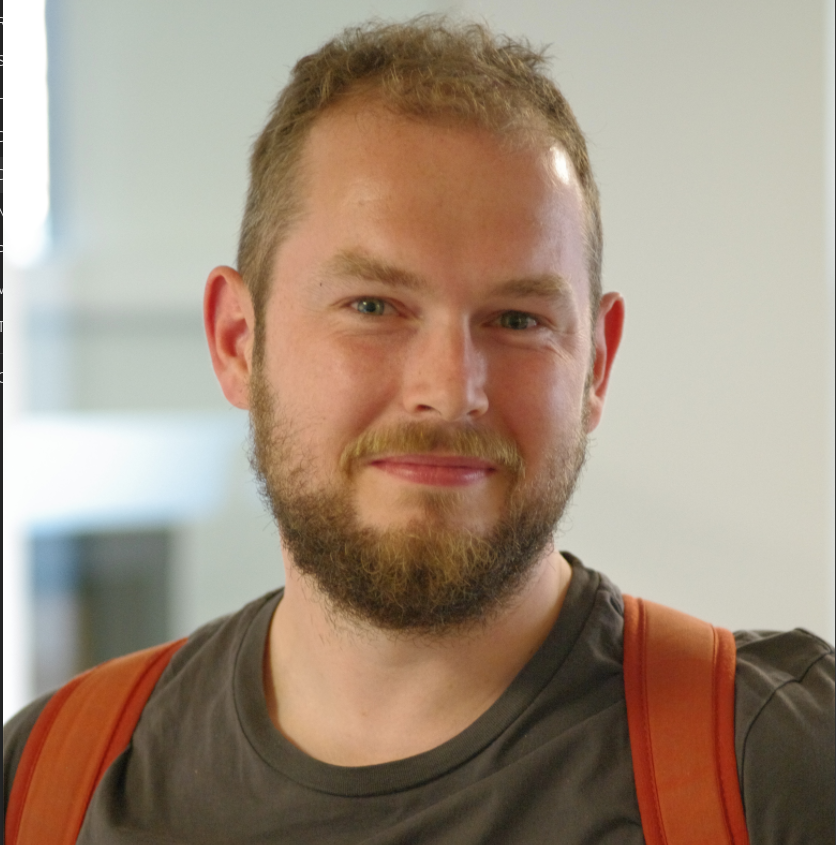

## About me

Hi, my name is Henk. This is a list of some things I did in the past, as well as some things I like and am good at. Which, in my experience, generally go hand in hand. 

I love making cool software with others using Rust 🦀. I focus on embedded and scalable (web) server software. I'm an enthusiastic Rust trainer and maintainer of the [teach-rs](https://github.com/tweedegolf/teach-rs) open source university course on Rust. Sharing my experience and excitement for Rust and tech, as well as learning from others, is what fuels me.

## Professional experience

 - **2018 - present:** *Embedded/backend developer at Tweede golf*
 
 My current employment at Tweede Golf is very diverse. I work on a multitude of projects, both web related and embedded. As an embedded developer, I gained a lot of knowledge on bare-metal driver development and embedded application development in Rust. I have worked with setups based on RTIC, Embassy, or with no runtime whatsoever. Backend development at Tweede Golf means creating custom web applications using Typescript (Node, React), but nowadays mostly Rust (Axum, Rocket), as well as working with Kubernetes to deploy applications to our cluster. I oversee the client communication and scrum master-like tasks at some of the projects I work on.

 - **2021 - present:** *Rust training lead at Tweede golf**

  When I'm not developing software, I'm sharing my knowledge, and that of my colleagues. As the Rust training lead at Tweede golf, not only do I organize and host the majority of our Rust trainings at external companies (in house or remotely), I also develop learning material. Be it trainings that aim to introduce Rust as a language, on embedded, or advanced Rust topics like FFI and async. My experience developing [teach-rs](https://github.com/tweedegolf/teach-rs) is of great help in this field.

 - **2017 - 2018:** *Lead developer at Baksteen Blockchain*
 
 At Baksteen, I designed and implemented decentralized applications (Dappss) for Ethereum, using the Solididy smart contract programming language. Most notably, I worked on Divisions, a fully decentralized proof of stake pooling platform. As project lead, I oversaw a team of five developers.

 - **2016:** *Internship at New Nexus Mobile*
 
 From my time at New Nexus Mobile, I gained experience in app development for both iOS and Android using Xamarin and C#. I worked at an app that enables users to send text, photo, video and voice messages to the future. The app's user interface is full of custom elements and micro-animations.

 - **2015 - 2017:** *Software developer at Rocketry*
 
 As a developer at Rocketry, I fulfilled a role as all-round IT-specialist. My main focus was on building a fully automated domain name webshop and designing and developing a crypto currency trading bot.

 - **2014 - 2015:** *Intership at PEJ Private Equity ad Brokerage*
 
 My internship at PEJ was about designing and implementing a prediction system for domain name traffic and value.

## Education
 - **2021-2022:** *Pre-master's Embedded Systems at Eindhoven University of Technology*

 - **2013-2018:** *Hbo Bachelor's degree Computer Science (Informatica) at Hanze University Groningen*
 
 Graduated in 2018. Specialized in Software Engineering. I combined my graduation project with the development of Divisions at Baksteen. As a minor, I have studied at the University of Huelva in Spain within the Erasmus+ program. 

 - **2012-2013:** *Wo Bachelor's degree Artificial Intelligence at University of Groningen*

 - **2010-2012:** *VWO at Greijdanus in Zwolle*

 Profile: Nature and Health (Natuur en Gezondheid). Graduated in 2012.

 - **2005-2010:** *HAVO at Greijdanus in Hardenberg*

 Profile: Nature and Health (Natuur en Gezondheid). Graduated in 2010.

## Skills
 - *Embedded software development using Rust*
 - *Hosting Rust trainings and courses*
 - *Web development using TypeScript and Rust*
 - *PCB design (KiCAD)*
 - *Database design*
 - *Being a Scrum Master*
 - *Being a quick and eager learer*
 - *Speaking at conferences*

## Languages
 - *Dutch (First language)*
 - *English (C2)*
 - *Spanish (A1)*

## Interests
 - *Being a great dad*
 - *My motorcycle, both riding and tinkering*
 - *Electronics, hardware development*

## Links
 - [GitHub Profile](https://github.com/hdoordt)
 - [LinkedIn Profile](https://www.linkedin.com/in/hdoordt/)

